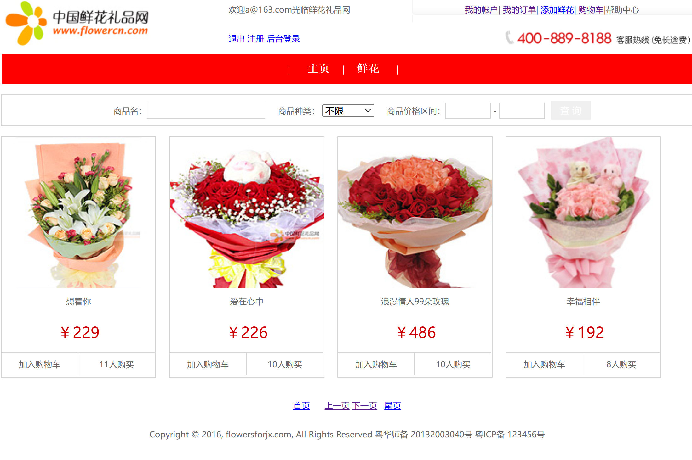
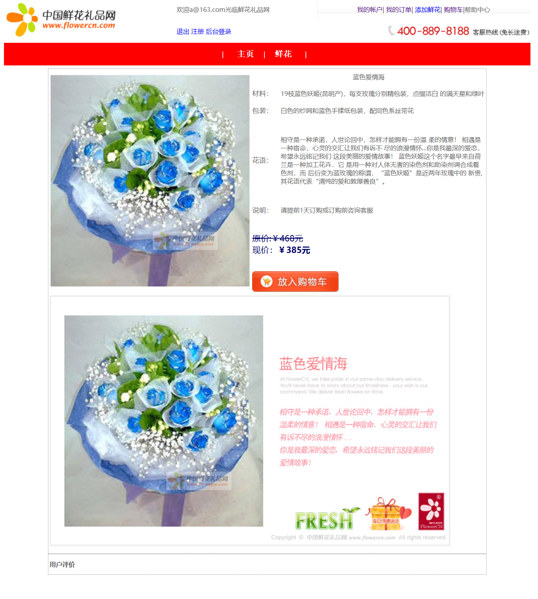
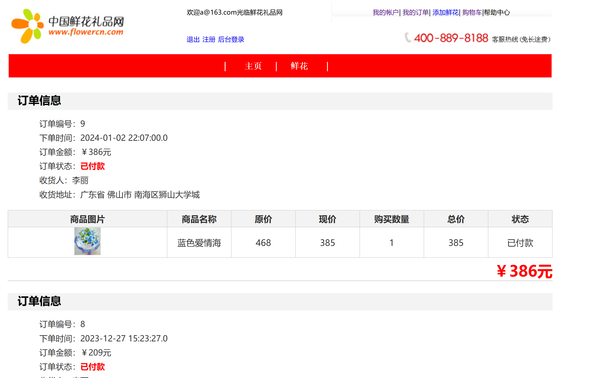
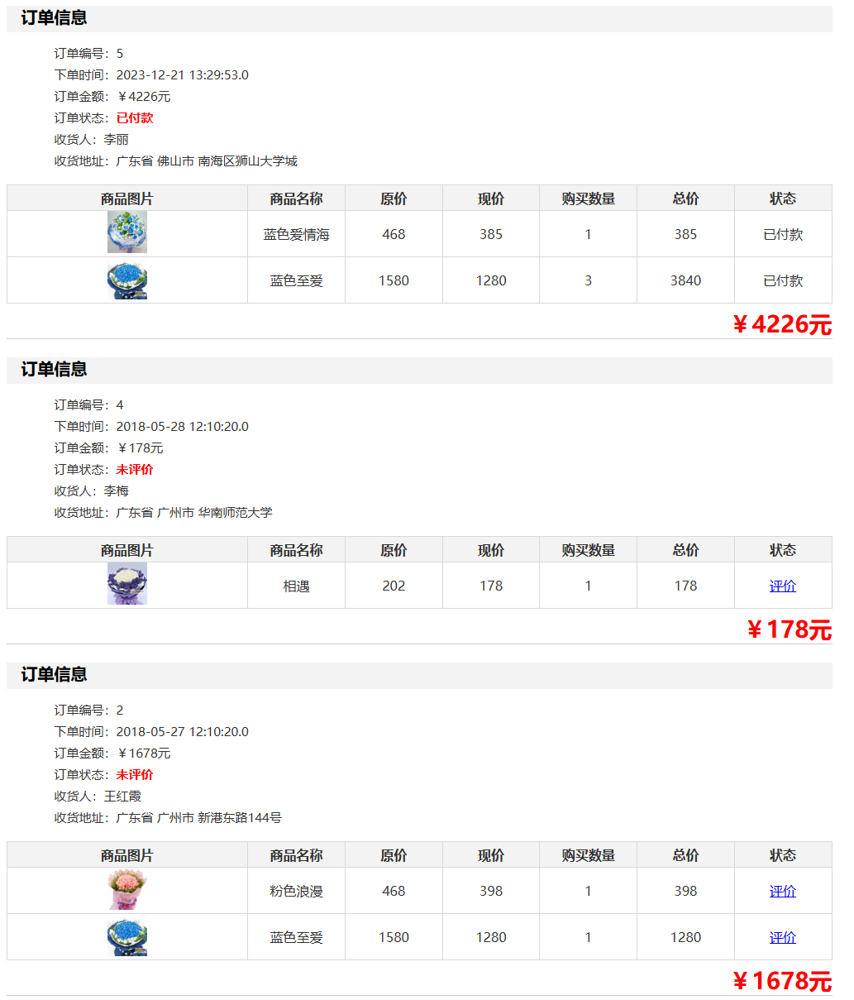
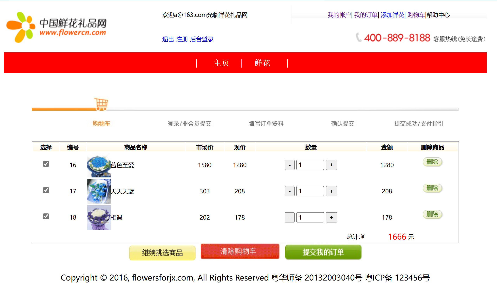
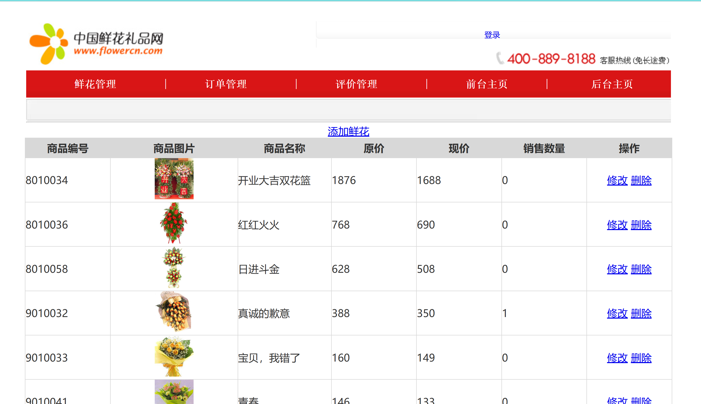
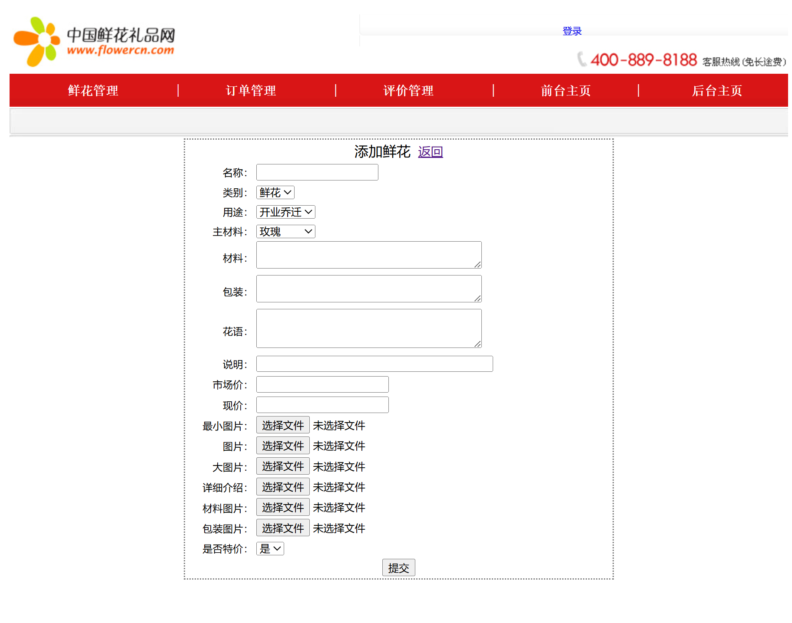
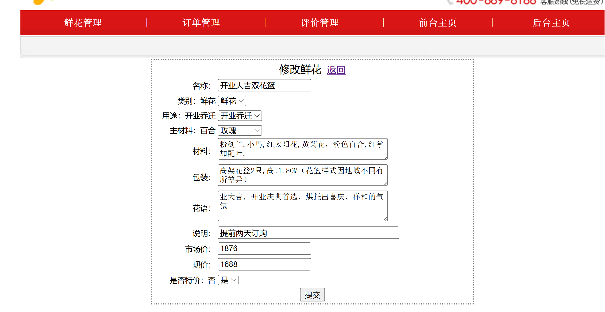

### 项目技术：

JDK11

Springboot2.7.16

MyBatis-plus3.5.3.1

Redis

MySQL8.0

Thymeleaf

### 项目介绍：

该项目为购花网站，分为用户部分和管理员部分，功能包括分页查询，查找商品，分类查询、模糊查询、价格查询，加入购物车功能，添加订单，评价功能，付款功能，后台商品功能，后台商品添加、修改、删除功能。

### 功能技术：

（1）MD5加密用户密码

（2）redis添加缓存

（3）mybatis-plus分页查询

（4）MultipartFile保存鲜花图片

### 功能界面：

#### 首页

#### 商品详情

#### 订单界面

#### 购物车界面

#### 管理员首页

#### 添加鲜花

#### 修改鲜花

